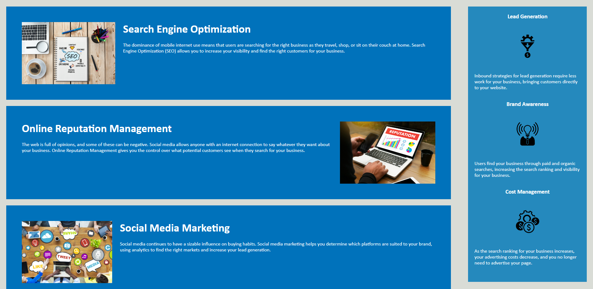

# <Horiseon Website Code Refactor - Week 1 Challenge>

## Description

The aim of this project was to make the existing Horiseon website more accessible for users. This was done through the addition of more descriptive semantic elements, alt attributes for all images and icons, and filled in titles for title elements. This will help assistive technology such as screen readers, as well as improve search engine optimisation. In this project, I learnt a lot about the proper structure of files, and how semantic HTML elements are used to better indicate their function in the code. 

## Installation

Website deploys at live URL
Link: 

## Usage

The website deploys from the link above. The website looks as it did pre-refactor, however it is now much easier to use with assistive technology.
Each link leads to the section on the website. 

## License

MIT License

